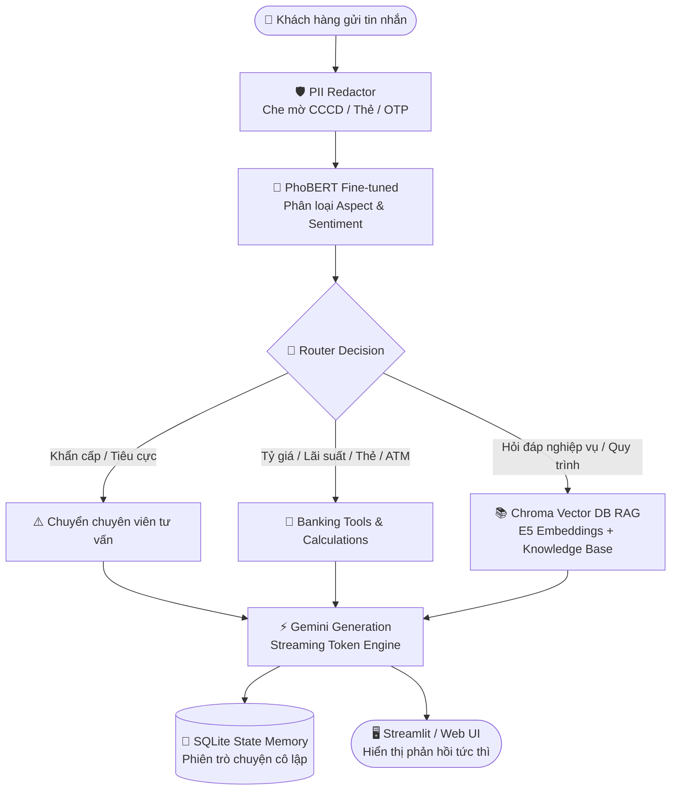

<div align="center">

# 🏦 Vietnamese Banking Assistant
### *Enterprise Multi-turn Agentic AI for Vietnamese Banking Services*

[](https://vn-banking-assistant.streamlit.app)
[](https://www.python.org/)
[](https://langchain-ai.github.io/langgraph/)
[](https://fastapi.tiangolo.com/)
[](https://huggingface.co/minhunhooo)

<br/>

> 🌐 **TRẢI NGHIỆM TRỰC TIẾP TẠI ĐÂY:**  
> ### 👉 [https://vn-banking-assistant.streamlit.app](https://vn-banking-assistant.streamlit.app) 👈

<br/>

</div>

---

## 📌 Giới thiệu Tổng quan (Overview)

**Vietnamese Banking Assistant** là hệ thống Trợ lý ảo AI thế hệ mới được thiết kế chuyên biệt cho ngành Ngân hàng – Tài chính tại Việt Nam. Hệ thống kết hợp sức mạnh của **Mô hình ngôn ngữ lớn (LLM)** với **Mô hình phân loại PhoBERT fine-tuned chuyên sâu**, kiến trúc điều phối **LangGraph StateGraph**, cơ sở tri thức **Chroma Vector RAG** và khiên bảo mật dữ liệu khách hàng **PII Redactor**.

### 🌟 Điểm nổi bật:
* 🚀 **Phản hồi siêu tốc & Streaming thời gian thực:** Token được truyền trực tiếp đến người dùng theo luồng mượt mà, độ trễ tối thiểu.
* 🧠 **Định tuyến thông minh (Smart Routing):** 2 mô hình PhoBERT phân tích Aspect (14 khía cạnh) và Sentiment (3 sắc thái cảm xúc) để quyết định luồng xử lý (RAG / Tools / Chuyển tư vấn viên).
* 💬 **Bộ nhớ đa lượt (Multi-turn Memory):** Tự động duy trì ngữ cảnh hội thoại, tự hiểu và viết lại các câu hỏi nối tiếp có đại từ mơ hồ (*"gói đó"*, *"kỳ hạn này"*...).
* 🔒 **Bảo mật dữ liệu ngân hàng (PII Shield):** Tự động phát hiện và che mờ thông tin nhạy cảm (Số CCCD 12 số, Số thẻ 16 số, Mã OTP) trước khi xử lý.
* 🧮 **Tích hợp bộ công cụ nghiệp vụ:** Tính lãi suất tiết kiệm chính xác, tra cứu tỷ giá ngoại tệ thực tế, kiểm tra thẻ và định vị cây ATM / Chi nhánh.

---

## 🎮 Trải nghiệm Nhanh (Quick Scenarios)

Bạn có thể truy cập ngay **[Live Demo](https://vn-banking-assistant.streamlit.app)** và thử nghiệm các kịch bản thực tế:

| Kịch bản | Câu hỏi mẫu thử nghiệm | Cơ chế xử lý |
|---|---|---|
| **Tra cứu tỷ giá** | *"Tỷ giá USD và EUR hôm nay bao nhiêu?"* | Gọi Tool tra cứu API ngoại tệ trực tiếp |
| **Tính lãi tiết kiệm** | *"Tính lãi giúp tôi gửi 200 triệu kỳ hạn 12 tháng lãi suất 5.8%"* | Tool tính toán tài chính & lãi kép |
| **Hỏi đáp quy trình** | *"Thủ tục mở thẻ tín dụng online cần những giấy tờ gì?"* | Chroma Vector DB (RAG) + Trích dẫn tri thức |
| **Bảo vệ PII** | *"Thẻ của tôi là 9704 1234 5678 9999 có bị khóa không?"* | PII Redactor che mờ số thẻ trước khi xử lý |
| **Tình huống khẩn cấp** | *"Tài khoản của tôi vừa bị trừ tiền lạ, hỗ trợ gấp!"* | Phát hiện cảm xúc tiêu cực ➡️ Tự động gắn nhãn Escalated |

---

## 🏗️ Kiến trúc Hệ thống (System Architecture)



---

## 🛠️ Công nghệ Sử dụng (Tech Stack)

* **Core & Agent Orchestration:** Python 3.10+, [LangGraph](https://github.com/langchain-ai/langgraph) (`StateGraph`, `SqliteSaver`)
* **NLP & Intent Classification:** [PhoBERT](https://huggingface.co/vinai/phobert-base-v2) fine-tuned trên UTS2017_Bank (Aspect & Sentiment)
* **Retrieval-Augmented Generation (RAG):** [ChromaDB](https://www.trychroma.com/), [Multilingual-E5](https://huggingface.co/intfloat/multilingual-e5-base) Embeddings
* **Generative AI:** Google Gemini API (`gemini-2.0-flash` / `gemini-1.5-flash`)
* **UI & Serving:** [Streamlit](https://streamlit.io/) Cloud, [FastAPI](https://fastapi.tiangolo.com/) (REST & Server-Sent Events SSE)
* **Testing & Quality Assurance:** Pytest (16+ Unit test cases kiểm thử logic routing, tools, PII, memory)

---

## 🚀 Hướng dẫn Cài đặt & Chạy Local

### 1. Clone Repository & Cài đặt Thư viện
```bash
git clone https://github.com/MinHung1411/vn-banking-assistant.git
cd vn-banking-assistant
pip install -r requirements.txt
```

### 2. Thiết lập Biến Môi trường
Tạo file `.env` tại thư mục gốc của dự án:
```env
GEMINI_API_KEY=your_gemini_api_key_here
GEMINI_MODEL=gemini-flash-latest
```

### 3. Khởi chạy Ứng dụng

* **Chạy giao diện Streamlit UI (Khuyên dùng):**
```bash
streamlit run app_streamlit.py
```

* **Chạy FastAPI Backend (kèm Web Voice UI):**
```bash
uvicorn api:app --reload --port 8000
```
Truy cập giao diện tại: `http://localhost:8000`

---

## 🐳 Khởi chạy với Docker

```bash
# Build và khởi chạy container
docker compose up --build -d
```

---

## 🧪 Chạy Kiểm thử (Unit Tests)

```bash
pytest tests/ -v
```

---

<div align="center">

Made with ❤️ by [MinHung1411](https://github.com/MinHung1411) • Trợ lý ảo AI ngân hàng tiếng Việt

</div>
